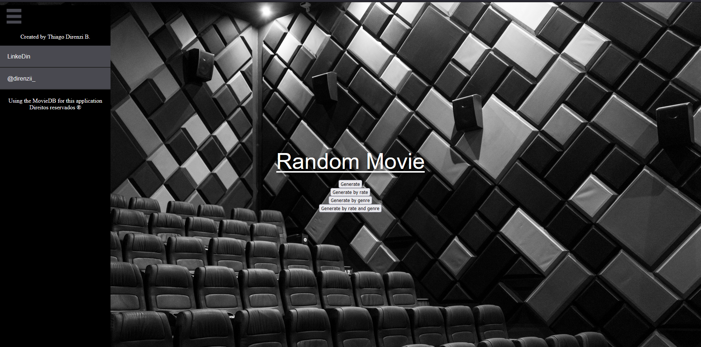
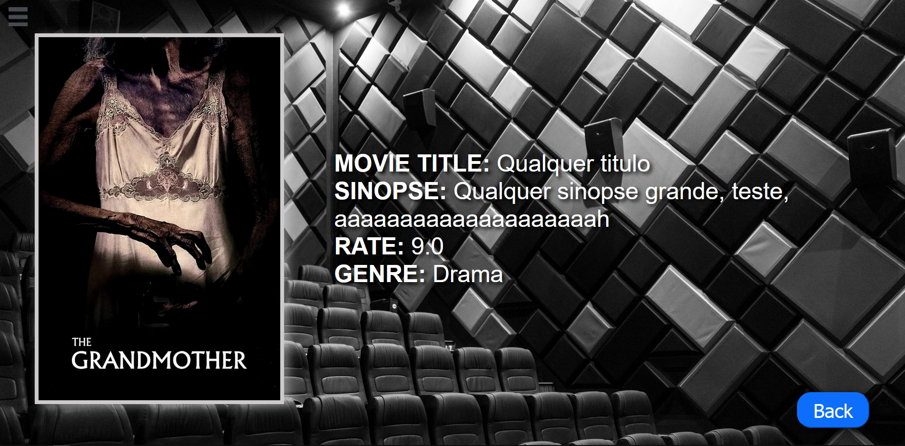
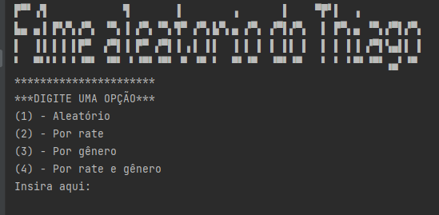
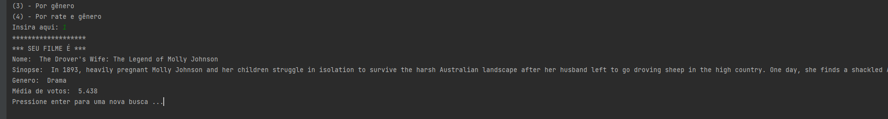
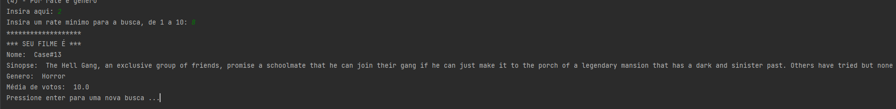
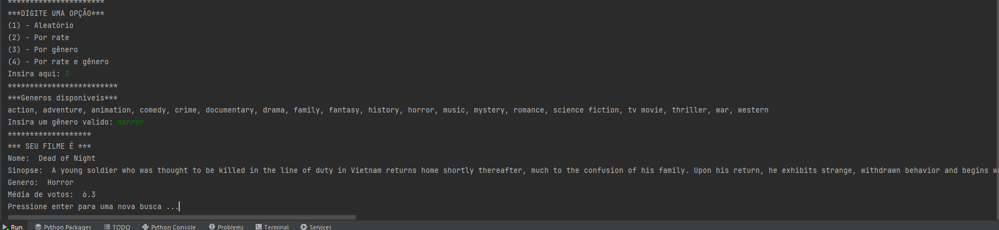
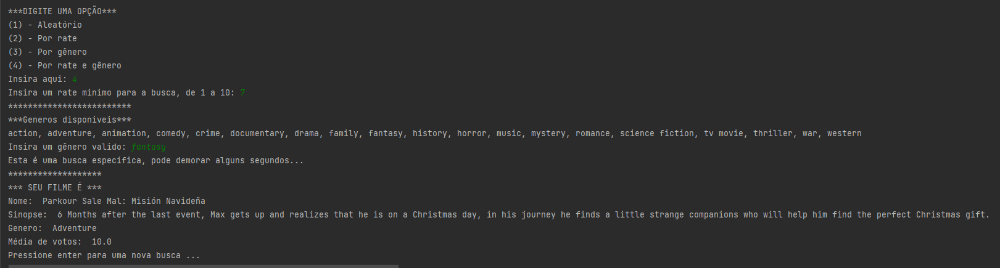

# Projeto Random Movie !

Projeto voltado ao desenvolvimento de um portal utilizando o FW Flask (Py), HTML, junto com o primeiro projeto "random_movie.py" para que seja possivel ver os resultados e as capas dos filmes na tela. (inacabado)

## Instalação

Apenas clone o repo e faça o download das dependencias

```bash
git clone https://github.com/Direnzii/random_movie.git
```

## Uso

Com esse projeto concluído, será possivel acessar o portal e por meio de ações simples, um processo ira startar, trazendo um filme aleatório para o usuario assistir.

```python
- A baixo apresentados o modelo HTML já estilizado (estático)
- Modo terminal (concluido)
```


Terminal mode ---





